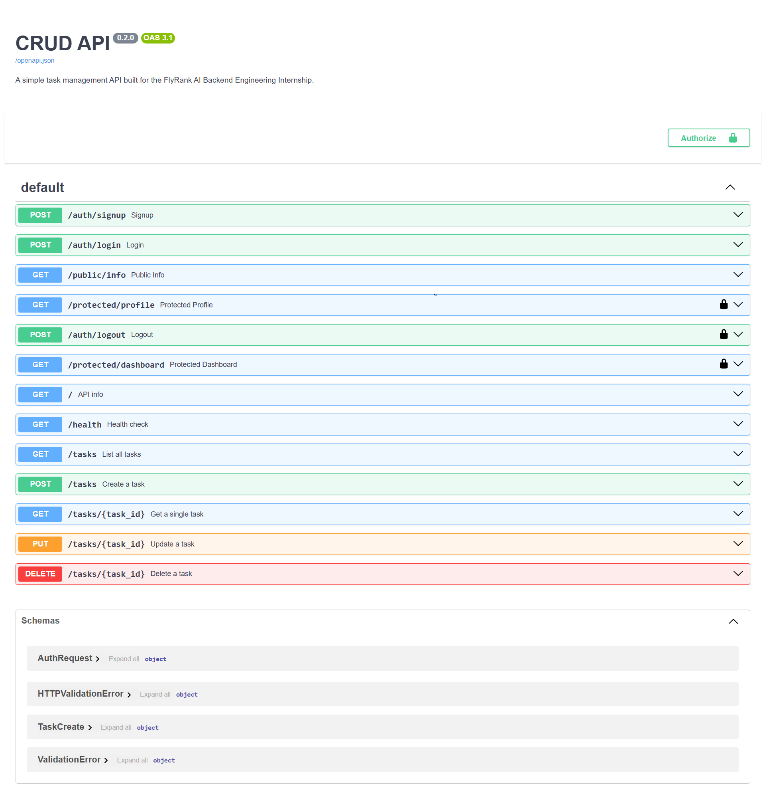

# CRUD API

A task management API built for the FlyRank AI Backend Engineering Internship. Started as an in-memory FastAPI CRUD app (A1), migrated to SQLite (A2), containerized with PostgreSQL in Docker (A3), and now secured with Supabase Auth (A4).

---

## Setup

1. Clone the repo and create a virtual environment:
   ```powershell
   python -m venv venv
   .\venv\Scripts\Activate.ps1
   pip install -r requirements.txt
   ```

2. Copy `.env.example` to `.env` and fill in real values:
   ```powershell
   cp .env.example .env
   ```
   - `DATABASE_URL` — matches the Postgres container defined in `compose.yaml` (see [Database](#database) below)
   - `SUPABASE_URL` / `SUPABASE_KEY` — from your Supabase project's **Settings → API Keys** page. Use the **anon** (legacy) or **publishable** key only — never the `service_role`/secret key.

   `.env` is git-ignored and never committed. `.env.example` is the reference for anyone cloning this repo.

3. Start PostgreSQL:
   ```powershell
   docker compose up -d
   ```

4. Run the API locally:
   ```powershell
   uvicorn main:app --reload
   ```

5. Open Swagger UI at `http://127.0.0.1:8000/docs` to explore and test endpoints interactively.

---

## Endpoints

| Method | Path | Description | Success | Error cases |
|--------|------|-------------|---------|-------------|
| GET | `/` | API info | 200 | — |
| GET | `/health` | Health check | 200 | — |
| GET | `/tasks` | List all tasks | 200 | — |
| GET | `/tasks/{id}` | Get a single task | 200 | 404 if not found |
| POST | `/tasks` | Create a task | 201 | 400 if title missing/empty |
| PUT | `/tasks/{id}` | Update a task | 200 | 400 invalid body, 404 not found |
| DELETE | `/tasks/{id}` | Delete a task | 204 | 404 if not found |

All error responses use the shape:
```json
{"error": "Task 99 not found"}
```

---

## Authentication

Auth is handled by Supabase. Sign up, log in, and receive a JWT access token — send it as a `Bearer` token on protected routes. Verification happens via a live call to Supabase (`supabase.auth.get_user(token)`), not local JWT decoding, so revoked/expired tokens are always caught server-side rather than trusted blindly.

The auth check is implemented once as a reusable FastAPI dependency (`get_current_user`) and applied to every protected route — no copy-pasted verification logic.

| Method | Path | Auth required | Success | Error cases |
|--------|------|----------------|---------|-------------|
| POST | `/auth/signup` | No | 201 | 400 missing fields |
| POST | `/auth/login` | No | 200 + access token | 400 missing fields, 401 bad credentials |
| POST | `/auth/logout` | Yes (Bearer) | 204 | 401 missing/invalid token |
| GET | `/protected/profile` | Yes (Bearer) | 200 + user info | 401 |
| GET | `/protected/dashboard` | Yes (Bearer) | 200 + welcome message | 401 |
| GET | `/public/info` | No | 200 | — |

Auth error responses use the same shape as the rest of the API:
```json
{"error": "invalid or expired token"}
```

**Example — sign up and log in:**
```powershell
curl.exe -X POST http://127.0.0.1:8000/auth/signup -H "Content-Type: application/json" -d '{\"email\":\"you@example.com\",\"password\":\"yourpassword\"}'

curl.exe -X POST http://127.0.0.1:8000/auth/login -H "Content-Type: application/json" -d '{\"email\":\"you@example.com\",\"password\":\"yourpassword\"}'
```

**Example — calling a protected route:**
```powershell
curl.exe http://127.0.0.1:8000/protected/dashboard -H "Authorization: Bearer <your_access_token>"
```

**Swagger UI:** `/docs` shows a padlock icon on protected routes. Click **Authorize**, paste your access token (no `Bearer` prefix needed — Swagger adds it automatically), and call any protected route directly from the browser.



---

## Example request

```powershell
curl.exe -i http://127.0.0.1:8080/tasks
```

```
HTTP/1.1 200 OK
content-type: application/json

[
  {"id": 1, "title": "Buy groceries", "done": false},
  {"id": 2, "title": "Write project report", "done": false},
  {"id": 3, "title": "Walk the dog", "done": true}
]
```

---

## Database

**Why PostgreSQL?**
SQLite (A2) is a single-file database — great for local development, but limited to one writer at a time and not suitable for multi-service production deployments. PostgreSQL is a full client-server database that handles concurrent connections, has a real boolean type, and is the standard choice for production FastAPI apps. Running it in Docker means zero local installation required.

**Schema:**
```sql
CREATE TABLE IF NOT EXISTS tasks (
    id    SERIAL PRIMARY KEY,
    title TEXT   NOT NULL,
    done  BOOLEAN NOT NULL DEFAULT FALSE
);
```

**Persistence:** Data lives in a named Docker volume (`tasks-db-data`). Running `docker compose down && docker compose up` preserves all data. Only `docker compose down -v` removes it.

---

## Tech stack

- Python 3.12
- FastAPI
- Uvicorn
- PostgreSQL 16 (via Docker)
- psycopg 3
- Supabase Auth
- Docker Compose


---

## LLM-backed enrichment (Week 6)

See [ENRICH-README.md](ENRICH-README.md) for the POST /enrich endpoint, design decisions, eval results, and the real-data pipeline connecting to the scraper output.
