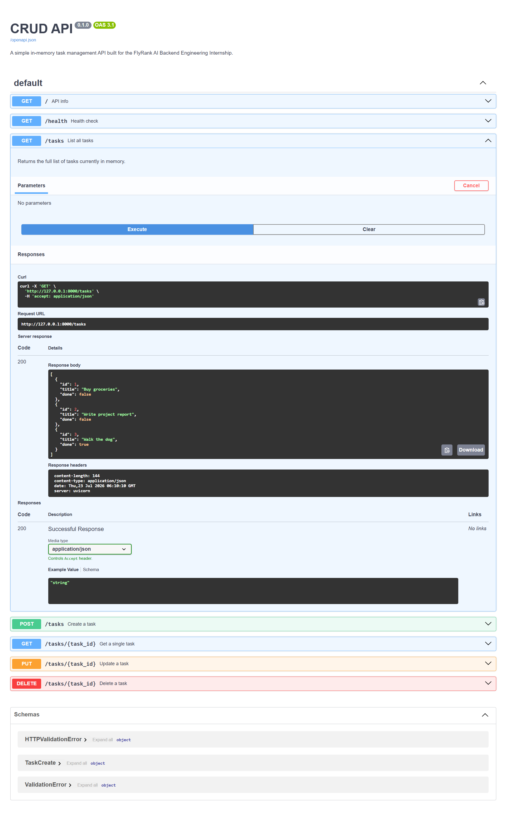

# CRUD API

A simple in-memory task management API built with FastAPI, as part of the FlyRank AI Backend Engineering Internship.

Supports full CRUD (Create, Read, Update, Delete) on tasks, with input validation, correct HTTP status codes, consistent JSON error responses, and interactive Swagger documentation.

**Note:** Data is stored in memory only and resets whenever the server restarts. Persistent storage (SQLite) is introduced in a later assignment.

---

## Running the project

Clone the repo, then from the project root:

```powershell
python -m venv venv
.\venv\Scripts\Activate.ps1
pip install -r requirements.txt
uvicorn main:app --reload
```

The API will be available at `http://127.0.0.1:8000`.
Interactive Swagger docs are available at `http://127.0.0.1:8000/docs`.

---

## Endpoints

| Method | Path            | Description                          | Success | Error cases           |
|--------|-----------------|---------------------------------------|---------|------------------------|
| GET    | `/`             | API info                              | 200     | —                       |
| GET    | `/health`       | Health check                          | 200     | —                       |
| GET    | `/tasks`        | List all tasks                        | 200     | —                       |
| GET    | `/tasks/{id}`   | Get a single task                     | 200     | 404 if not found        |
| POST   | `/tasks`        | Create a task                         | 201     | 400 if title missing/empty |
| PUT    | `/tasks/{id}`   | Update a task                         | 200     | 400 invalid body, 404 not found |
| DELETE | `/tasks/{id}`   | Delete a task                         | 204     | 404 if not found        |

All error responses use the shape:
```json
{"error": "Task 99 not found"}
```

---

## Example request

```powershell
curl.exe -i http://127.0.0.1:8000/tasks
```
HTTP/1.1 200 OK
content-type: application/json
[
{"id": 1, "title": "Buy groceries", "done": false},
{"id": 2, "title": "Write project report", "done": false},
{"id": 3, "title": "Walk the dog", "done": true}
]
---

## Swagger UI



---

## Tech stack

- Python 3.12
- FastAPI
- Uvicorn